<!-- title: Introduction to biological analyzing methods
  -->
# Introduction to biological analyzing methods

The following code follows the slides of the 2A BasicAnalysis presentation. Sections are labeled to be able to follow along with the presentation.

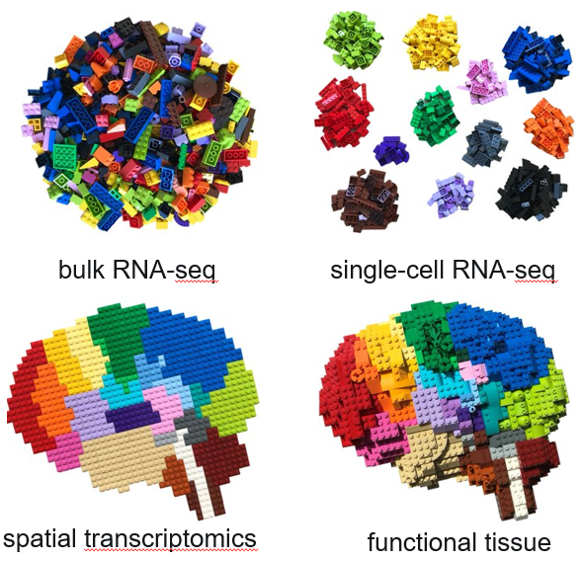


# System Requirement
Tested on Windows 11 12th Gen Intel(R) i7-1265U with R version 4.2.1.

# Installation

Installation instructions will be included in the following code sections. 

# Data visualization on single cells

## Section 1:
### Set up your R enviorment

```
# Install new packages
install.packages('Seurat')
library(Seurat)
```

## Section 2: 
### Create a SeuratObject

```
# 2.1 read in 10X folder
pbmc.data<- Read10X(”./data1")

# 2.1 (optional) read in 10X h5 file; You can also read csv or txt files
pbmc.data <- Read10X_h5("5k_pbmc_v3_filtered_feature_bc_matrix.h5")

# 2.2 create Seurat Object
pbmc <- CreateSeuratObject(counts =  pbmc.data, min.cells = 3,min.features = 200)
pbmc

```

## Section 3: 
### Processing data (QC, normalization, feature selection)

```
# 3.1 Quality control (QC)
# 3.1.1 calculate mitochondrial gene percentage for each cell. (^Mt- or ^mt-)
pbmc[["percent.mt"]] <- PercentageFeatureSet(pbmc, pattern = "^MT-")

# 3.1.2 Plot QC matrics
VlnPlot(pbmc, 
        features = c("nFeature_RNA","nCount_RNA","percent.mt"),
        ncol = 3)

pbmc <- subset(pbmc, 
               subset = percent.mt < 5 & nFeature_RNA > 200 & nFeature_RNA < 2500)
```
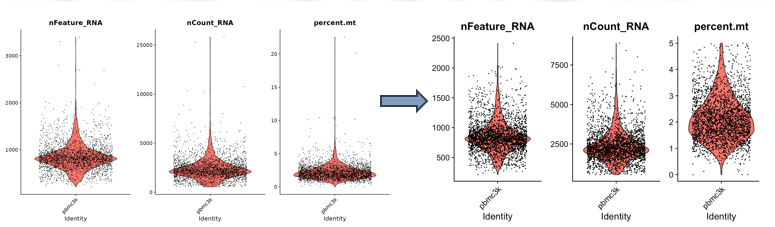
```
# 3.2 normalization (Or check tutorial for scTransform V2)
pbmc <- NormalizeData(pbmc, normalization.method = "LogNormalize", scale.factor = 10000)

# 3.3 feature selection
pbmc  <- FindVariableFeatures(pbmc, selection.method = "vst", nfeatures = 2000)
top10 <- head(VariableFeatures(pbmc), 10)
plot1 <- VariableFeaturePlot(pbmc)
LabelPoints(plot = plot1, points = top10, repel = TRUE)

```
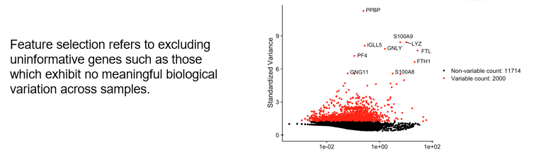
```
# 3.4 scaling data and remove unwanted variation
pbmc <- ScaleData(object =  pbmc, vars.to.regress = c("percent.mt"))
```

## Section 4: 
### Linear dimension reduction (PCA)

```
# 4.1 linear dimension reduction
SeuratObject <- RunPCA(pbmc, features = VariableFeatures(object = pbmc))
# 4.2 visualize top genes associated with reduction components
VizDimLoadings(pbmc, dims = 1:2, reduction = "pca")
# 4.3 visualize PCA results
DimPlot(object =  pbmc, reduction = "pca")
# 4.4 easy exploration of the primary sources of heterogeneity in a dataset
DimHeatmap(pbmc, dims = 1, cells = 500, balanced = TRUE)
```
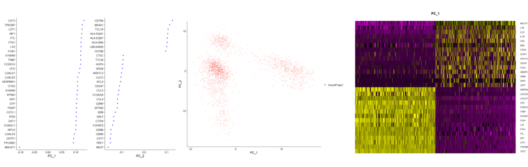

### Choosing reasonable PCs for further analysis
```
# method I: use DimHeapmap
DimHeatmap(pbmc, dims = 1:15, cells = 500, balanced = TRUE)

# method II: Elbow plot 
ElbowPlot(pbmc)

```
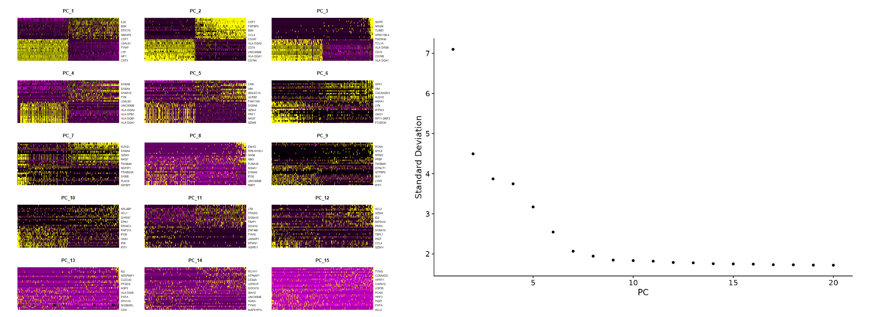


## Section 5: 
### UMAP & clustering 

```
# 5.1 construct a KNN graph based on the euclidean distance in PCA space
pbmc  <- FindNeighbors(pbmc, dims = 1:7)
# 5.2 cluster based on Louvain alogorithm
pbmc  <- FindClusters(pbmc, resolution = 0.5)
# 5.3 non-linear dimensional reduction (UMAP)
pbmc  <- RunUMAP(pbmc, dims = 1:7)
# 5.4 visualization on UMAP
DimPlot(pbmc, reduction = "umap")
# use Idents(pbmc)<-"XX" to select the active meta information for plot.
```
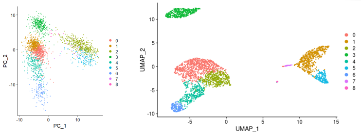

## Section 6: 
### Find DEG based on clustering results
```
# 6.1 find DEG between two selected clusters 
DefaultAssay(pbmc) <- "RNA"
cluster1.markers <- FindMarkers(pbmc, ident.1 = 1, min.pct = 0.25)
cluster5.markers <- FindMarkers(pbmc, ident.1 = 5, ident.2 = c(0, 3), min.pct = 0.25)

# 6.2 look at the DEG result
cluster1.markers[1:5,]
```
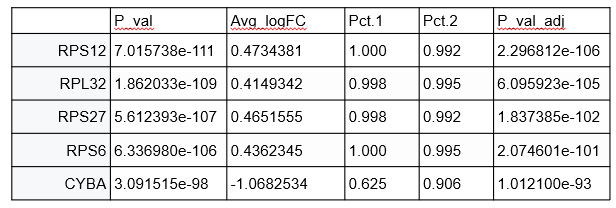
```
# 6.3 find DEG for each clustering in one code
pbmc.markers <- FindAllMarkers(pbmc, only.pos = TRUE, min.pct = 0.25, logfc.threshold = 0.25)
# 6.4 look at the DEG result
pbmc.markers[1:5,]
```
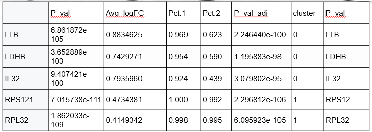

## Section 7: 
### Gene expression visualization
```
# 7.1 violin plot visualizes interested gene distribution in each clusters.
VlnPlot(pbmc, features = c("NKG7"), slot = "counts", log = TRUE)
# 7.2 color cells with expression value on UMAP 
FeaturePlot(pbmc, features = c("NKG7"))
# 7.3 Gene expression across clusters on dot plot
DotPlot(pbmc, features = c("NKG7"))
# 7.4 visualize DEG gene in heatmap
top10 <-  pbmc.markers %>% group_by(cluster) %>% top_n(n = 10, wt = avg_logFC)
DoHeatmap(SeuratObject, features = top10$gene) + NoLegend()
```
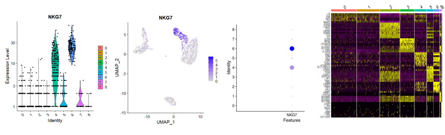

## Section 8: 
### Manual cell type annotation
```
new.cluster.ids <- c(”CT1", "CT2", "CT3", "CT4", "CT5", "CT6", "CT7”, "CT8")

names(new.cluster.ids) <- levels(SeuratObject)

SeuratObject <- RenameIdents(SeuratObject, new.cluster.ids)

DimPlot(SeuratObject, reduction = "umap", label = TRUE, pt.size = 0.5) + NoLegend()
```
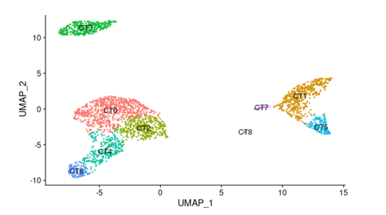

# Multiple scRNA-seq data integration and query mapping
```
# Install new packages
#devtools::install_github('satijalab/seurat-data’)
#library(SeuratData)

#InstallData("panc8")

# Load Seurat example data
data("panc8")
pancreas.list <- SplitObject(panc8, split.by = "tech")
pancreas.list <- pancreas.list[c("celseq", "celseq2", "fluidigmc1", "smartseq2")]

# standard preprocessing steps
for (i in 1:length(pancreas.list)) {    
  pancreas.list[[i]] <- NormalizeData(pancreas.list[[i]])    	
  pancreas.list[[i]] <- FindVariableFeatures(pancreas.list[[i]], selection.method = 						"vst", nfeatures = 2000)
}
```

### Here what would be done normally
```
# Back to the example
# create a list
reference.list <- pancreas.list[c("celseq", "celseq2", "smartseq2")]

# select features that are repeatedly variable across datasets for integration
# NOTE: this is optional and not recommended for more data integration
features <- SelectIntegrationFeatures(object.list = reference.list)

# find integration anchors …
pancreas.anchors <- FindIntegrationAnchors(object.list = reference.list, dims = 1:30)

# … and integrate
data.combined <- IntegrateData(anchorset = pancreas.anchors, anchor.features = 2000)

# switch to integration assay
DefaultAssay(pancreas.integrated) <- "integrated"
```

## Dimension reduction and cell clustering:
```
# Standard workflow for visualization and clustering
pancreas.integrated <- ScaleData(pancreas.integrated, verbose = FALSE)
pancreas.integrated <- RunPCA(pancreas.integrated, npcs = 30, verbose = FALSE)
pancreas.integrated <- RunUMAP(pancreas.integrated, reduction = "pca", dims = 1:30, verbose = FALSE)

# For this example, we do not perform cell clustering as the cell type labels have predicted already and provided. Yet, in your case, please do that by using the following code.
#   data.combined <- FindNeighbors(data.combined, reduction = "pca", dims = 1:15)
#   data.combined <- FindClusters(data.combined, resolution = 0.5)
```
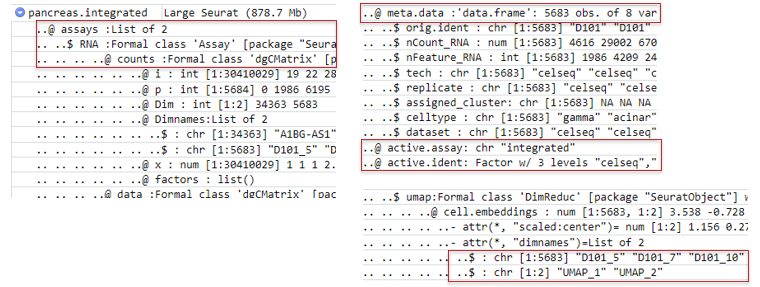

## UMAP visualization:
```
# Number of cells in each condition
table(pancreas.integrated@meta.data$tech)
table(pancreas.integrated@meta.data$tech, pancreas.integrated@meta.data$celltype)

# Visualization
p1 <- DimPlot(pancreas.integrated, reduction = "umap", group.by = "tech")
p2 <- DimPlot(pancreas.integrated, reduction = "umap", group.by = "celltype", label = TRUE, repel = TRUE) + NoLegend()
p3 <- DimPlot(pancreas.integrated, reduction = "umap", split.by = " tech")
p1 + p2 + p3
```
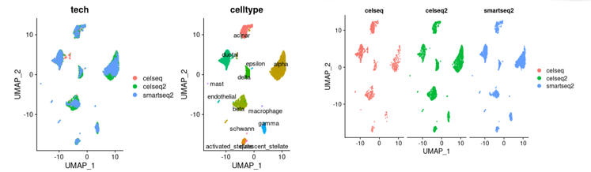

### More about UMAP
```
p2 <- DimPlot(pancreas.integrated, reduction = "umap", group.by = "celltype", label = TRUE, repel = TRUE) + NoLegend()

p4 <- DimPlot(pancreas.integrated, reduction = "umap", group.by = "celltype", label = TRUE, repel = FALSE)

p5 <- DimPlot(pancreas.integrated, reduction = "umap", group.by = "celltype")
LabelClusters(p3, id = "celltype", color = unique(ggplot_build(p3)$data[[1]]$colour), size = 5, repel = T, box.padding = 1.25)
```
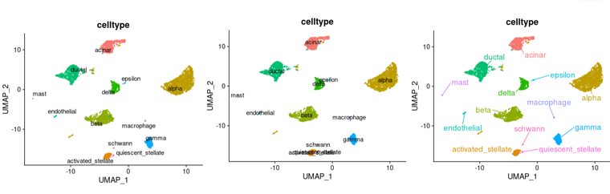

## DEG Analysis
```
# Remember to switch to raw data for DEG
DefaultAssay(pancreas.integrated) <- "RNA"

# Find DEGs in celseq
celseq.markers <- FindMarkers(pancreas.integrated, ident.1 = "celseq",group.by = "tech", 	logfc.threshold = 0.25, only.pos = TRUE)

# Find DEGs in alpha
Idents(pancreas.integrated) <- "celltype"
alpha.markers <- FindMarkers(pancreas.integrated, ident.1 = "acinar", logfc.threshold = 	0.25, only.pos = TRUE)

# Find conserved DEGs among techs 
all.markers <- FindConservedMarkers(pancreas.integrated, ident.1 = c("acinar"), 	grouping.var = "tech")
```
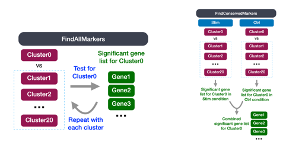

```
# Find DEGs for all techs
Idents(pancreas.integrated) <- "tech" 
all.markers <- FindAllMarkers(pancreas.integrated, logfc.threshold = 0.25, only.pos = 						TRUE)
top_10_marker <- all.markers %>% group_by(cluster) %>% top_n(n =10, avg_log2FC)
head(top_10_marker)

# Draw heatmap
DoHeatmap(pancreas.integrated,features = top_10_marker$gene,slot="counts", size = 4) + scale_fill_gradientn(colors = RColorBrewer::brewer.pal(n = 9, name = "RdBu"))
```
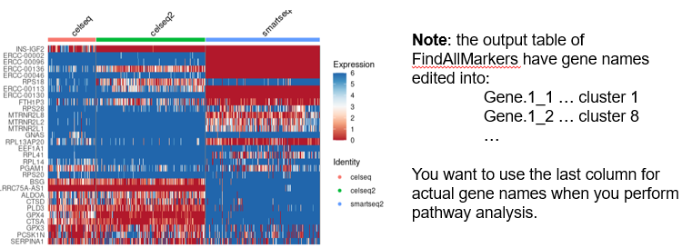

## Marker gene visualizations
```
Idents(pancreas.integrated) <- "tech" 
VlnPlot(pancreas.integrated, features =c("REG1A"))
VlnPlot(pancreas.integrated, features =c("REG1A"), group.by = "celltype")
VlnPlot(pancreas.integrated, features = c("REG1A"),split.by = "tech")

pancreas.integrated.sub <- subset(pancreas.integrated, idents=c("celseq","celseq2"))
VlnPlot(pancreas.integrated.sub, features = c("REG1A"),group.by = "celltype",
    split.by = "tech", cols=c("red","grey","blue"), pt.size = 0)
FeaturePlot(pancreas.integrated, features = c("REG1A"), split.by = "tech",
    max.cutoff = 3, cols = c("grey", "red"))
```
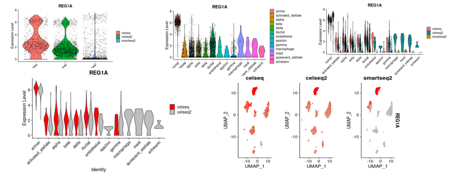

## Type 2: Reference mapping
```
pancreas.query <- pancreas.list[["fluidigmc1"]]

pancreas.anchors <- FindTransferAnchors(reference = pancreas.integrated, 
        query = pancreas.query, dims = 1:30, reference.reduction = "pca")

predictions <- TransferData(anchorset = pancreas.anchors, 
            refdata = pancreas.integrated$celltype, dims = 1:30)

pancreas.query <- AddMetaData(pancreas.query, metadata = predictions)

# check if the mapped (prediction) align well with the bench.
pancreas.query$prediction.match <- pancreas.query$predicted.id == pancreas.query$celltype

table(pancreas.query$prediction.match)
```
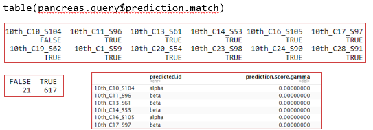

## UMAP visualization
```
DefaultAssay(pancreas.integrated) <- "RNA"
pancreas.integrated <- RunUMAP(pancreas.integrated, dims = 1:30, reduction = "pca", 	return.model = TRUE)
pancreas.query <- MapQuery(anchorset = pancreas.anchors, reference = pancreas.integrated, 
  query = pancreas.query, refdata = list(celltype = "celltype"), reference.reduction = 	"pca", reduction.model = "umap")
p1 <- DimPlot(pancreas.integrated, reduction = "umap", group.by = "celltype", label = 	TRUE, label.size = 3,    repel = TRUE) + NoLegend() + ggtitle("Reference 	annotations")
p2 <- DimPlot(pancreas.query, reduction = "ref.umap", group.by = "predicted.celltype", 	label = TRUE,    label.size = 3, repel = TRUE) + NoLegend() + ggtitle("Query 	transferred labels")
p1 + p2
```
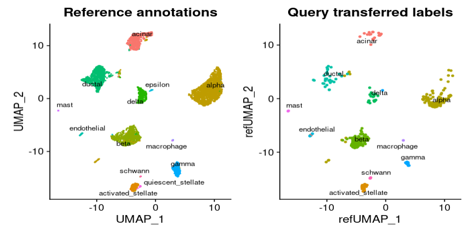

## More marker gene visualizations
```
VlnPlot(pancreas.query, features =c("REG1A"), group.by = "celltype")

pancreas.merge <- merge(pancreas.integrated,pancreas.query)
VlnPlot(pancreas.merge, features =c("REG1A"), group.by = "celltype", split.by = 	"tech",cols=c("red","grey","blue","green"), pt.size = 0)

markers.to.plot <- c("CD3D", "CREM", "HSPH1", "SELL", "GIMAP5", "CACYBP", "GNLY", 	"NKG7", "CCL5", "CD8A", "MS4A1", "CD79A)
DotPlot(pancreas.merge, features = markers.to.plot, cols = c("blue", "red“, ”yellow”, 	”green”), dot.scale = 8, split.by = “tech") +   RotatedAxis()
```
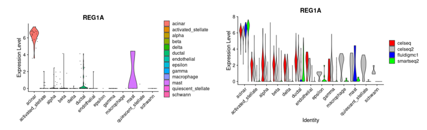

## Sankey plot
```
# create framework of two labels
sankey.dat <- 	data.frame(source=pancreas.query$predicted.id,target=pancreas.query$celltype, 	value=rep(1, length(pancreas.query$celltype)))
sankey.dat$new <- paste(sankey.dat$source, sankey.dat$target)

# create a connecting data frame of label pair frequencies
sankey.link <- aggregate(value~new, sankey.dat,sum)
sankey.link <- separate(sankey.link, col = new, into = c("source", "target"), sep = " ")
sankey.link$target <- paste(sankey.link$target, " ", sep="")

# create a node data frame of all unique labels
sankey.nodes <- data.frame(name=c(as.character(sankey.link$source),   	as.character(sankey.link$target)) %>% unique())
```
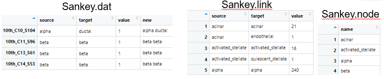

```
# transfer target and source names to node numbers
sankey.link$IDsource <- match(sankey.link$source, sankey.nodes$name)-1 
sankey.link$IDtarget <- match(sankey.link$target, sankey.nodes$name)-1

p <- sankeyNetwork(Links = sankey.link, Nodes = sankey.nodes,              
        Source = "IDsource", Target = "IDtarget",              
        Value = "value", NodeID = "name",               
        sinksRight=FALSE, fontSize=15, nodeWidth=40,nodePadding=10)
p
```


# Workflow of Monocle 3
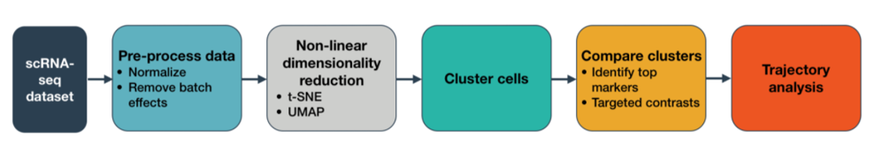


## Install & Start Monocle 3
```
install.packages("devtools")
devtools::install_github('cole-trapnell-lab/leidenbase’)
devtools::install_github('cole-trapnell-lab/monocle3’)

library(monocle3)
library(ggplot2)
library(dplyr)

# Load individual data
expression_matrix <- readRDS(url("http://staff.washington.edu/hpliner/data/cao_l2_expression.rds"))
cell_metadata <- readRDS(url("http://staff.washington.edu/hpliner/data/cao_l2_colData.rds"))
gene_annotation <- readRDS(url("http://staff.washington.edu/hpliner/data/cao_l2_rowData.rds"))

# Create Monocle object
cds <- new_cell_data_set(expression_matrix,
                         cell_metadata = cell_metadata,
                         gene_metadata = gene_annotation)
```

### Alternative ways for loading
```
# Load by path for 10X data
cds <- load_cellranger_data("~/Downloads/10x_data")
cds <- load_mm_data(mat_path = "~/Downloads/matrix.mtx", 
                    feature_anno_path = "~/Downloads/features.tsv", 
                    cell_anno_path = "~/Downloads/barcodes.tsv")

# Load large dataset – switch to sparse matrix
cds <- new_cell_data_set(as(umi_matrix, "sparseMatrix"),
                         cell_metadata = cell_metadata,
                         gene_metadata = gene_metadata)

# combine object if needed
big_cds <- combine_cds(list(cds, cds2))

```

## Processing and dimension reduction
```
# preprocess and find low dimensions
cds <- preprocess_cds(cds, num_dim = 50)
# cds <- preprocess_cds(cds, method = c("PCA", "LSI"),num_dim = 50, norm_method = c("log", "size_only", "none"), use_genes = NULL,pseudo_count = NULL,scaling = TRUE)

# Check elbow plot
plot_pc_variance_explained(cds)

# Reduce for 2 UMAP dimensions
cds <- reduce_dimension(cds, max_components = 2,                     
            reduction_method = "UMAP",                        
            preprocess_method = "PCA")

# Observe UMAP
plot_cells(cds)
```

## Clustering and UMAP visualization
```
# cluster cells
cds = cluster_cells(cds, resolution=1e-5)

# select genes to check feature plot
int_genes <- c("che-1","hlh-17","nhr-6","dmd-6","ceh-36","ham-1")

# more plots
plot_cells(cds, color_cells_by="cao_cell_type")
plot_cells(cds, color_cells_by="cluster")
plot_cells(cds, color_cells_by="partition")
plot_cells(cds, genes=int_genes)
```
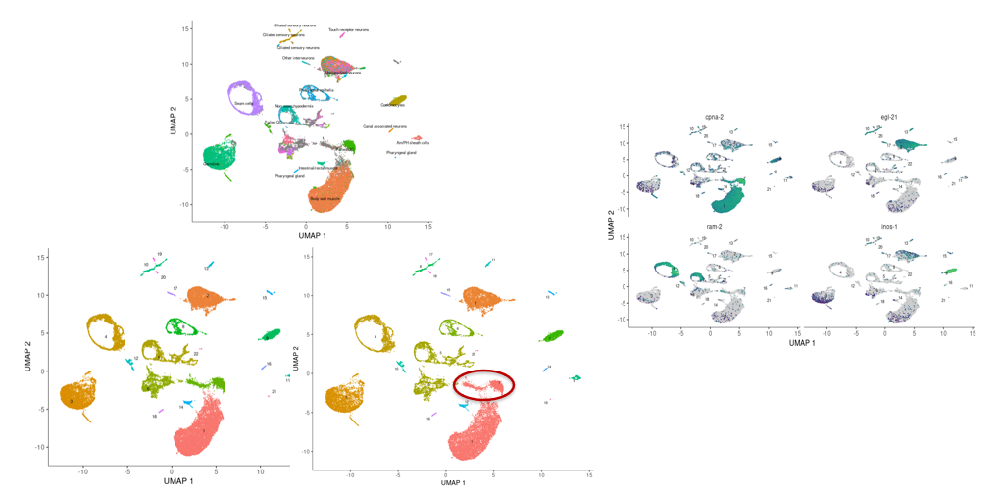

## Find differentially expressed genes
```
# find DE genes for each “partition” (merged cell cluster)
marker_test_res <- top_markers(cds, group_cells_by="partition", reference_cells=1000, cores=8)

# select top DE genes
top_specific_markers <- marker_test_res %>%  
      filter(fraction_expressing >= 0.10) %>%  
      group_by(cell_group) %>% 
      top_n(1, pseudo_R2)

# remove repeated DE genes among clusters
top_specific_marker_ids <- unique(top_specific_markers %>% 
          pull(gene_id))

# draw plot
plot_genes_by_group(cds, top_specific_marker_ids,                    
      group_cells_by="partition",                   
      ordering_type="maximal_on_diag", 
      max.size=3)
```
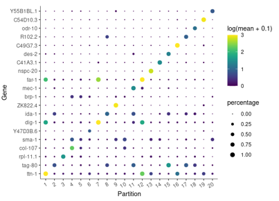

## Annotate your data
```
# Create a new column in colData(cds)
colData(cds)$assigned_cell_type <- as.character(partitions(cds))

# Assign cell labels
colData(cds)$assigned_cell_type <- dplyr::recode(colData(cds)$anno_cell_type,  
                                             "1"="Germline",  
                                              "2"="Body wall muscle",        
                                          "3"="Unclassified neurons", ...)

# Check your relabeled UMAP
plot_cells(cds, group_cells_by="partition", 
    color_cells_by="anno_cell_type")
```
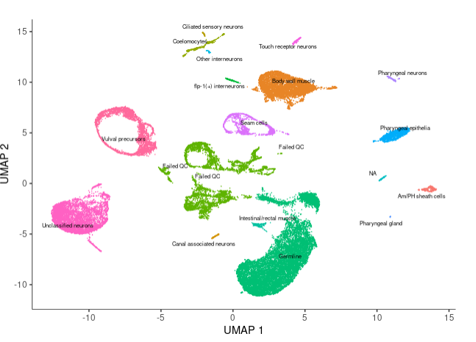

## Subset your data
```
cds_subset <- choose_cells(cds)
```
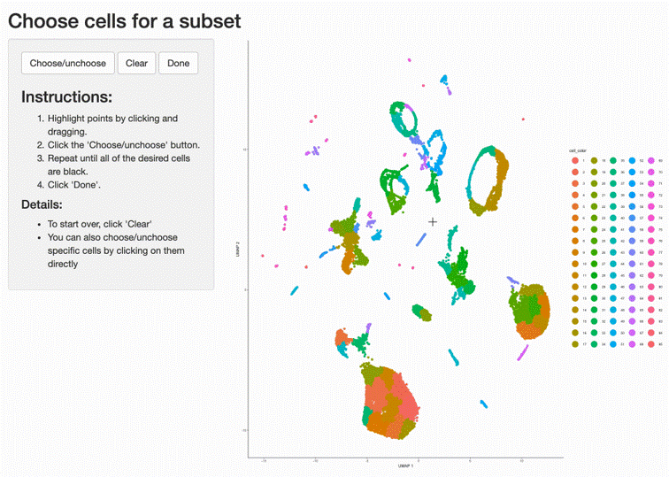

## Learn trajectory
```
cds <- learn_graph(cds)

plot_cells(cds,
           color_cells_by = "cao_cell_type",
           label_groups_by_cluster=FALSE,
           label_leaves=FALSE,
           label_branch_points=FALSE)
```
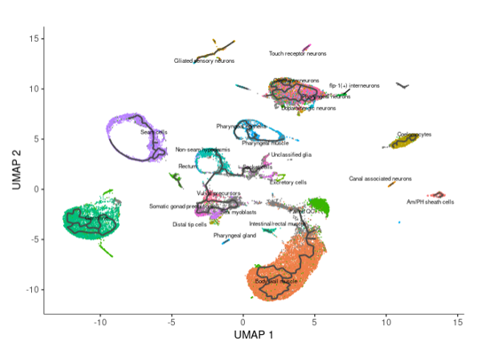

## Predict pseudo-time 
```
cds <- order_cells(cds)  #manually select root cell

plot_cells(cds, color_cells_by = "pseudotime", label_cell_groups=FALSE, 
            label_leaves=FALSE, label_branch_points=FALSE, graph_label_size=1.5)
```
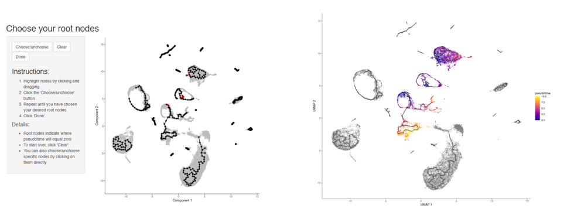

## A better example
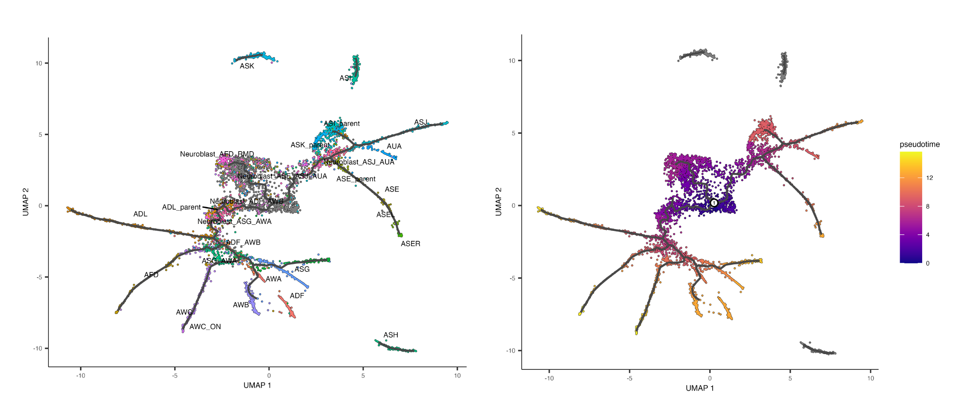

## Subset data by pseudo-time 
```
cds_sub <- choose_graph_segments(cds)
```
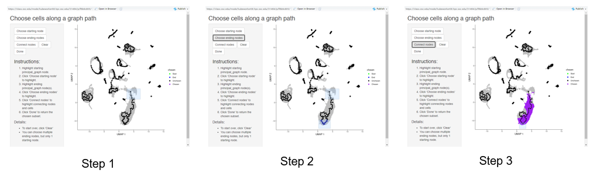


## 3D visualization
```
get_earliest_principal_node <- function(cds, time_bin="Germline"){
  cell_ids <- which(colData(cds)[, "cao_cell_type"] == time_bin)    
  closest_vertex <- cds@principal_graph_aux[["UMAP"]]$pr_graph_cell_proj_closest_vertex  	closest_vertex <- as.matrix(closest_vertex[colnames(cds), ])  
  root_pr_nodes <- igraph::V(principal_graph(cds)[["UMAP"]])$name[as.numeric(names                                                              					(which.max(table(closest_vertex[cell_ids,]))))]    
  root_pr_nodes
}

cds_3d <- reduce_dimension(cds, max_components = 3)
cds_3d <- cluster_cells(cds_3d)
cds_3d <- learn_graph(cds_3d)
cds_3d <- order_cells(cds_3d, root_pr_nodes=get_earliest_principal_node(cds, "Germline"))
cds_3d_plot_obj <- plot_cells_3d(cds_3d, color_cells_by="partition")
print(cds_3d_plot_obj) 
```
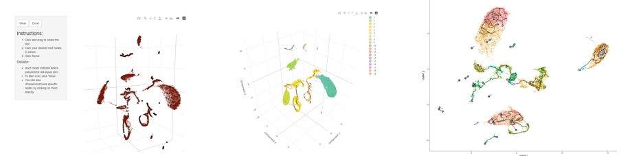

## Transferring between Seurat and Monocle 3
```
# Monocole 3 -> Seurat
Seurat.data<- as.Seurat(cds, assay = NULL)

# Seurat -> Monocle 3
cds <- as.cell_data_set(Seurat.data)
```

# References:
1. https://github.com/satijalab/seurat
2. https://github.com/cole-trapnell-lab/monocle3

