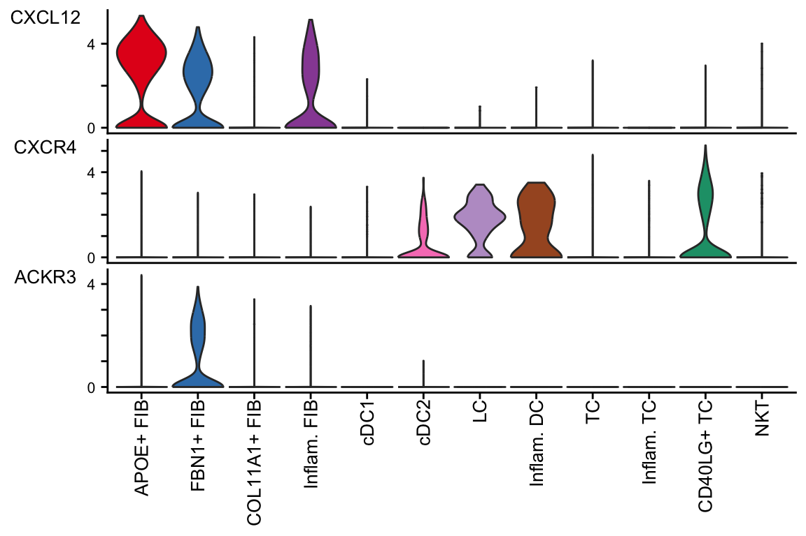

<!-- title: Cell cell communications in spatial transcriptomics  -->
# CellChat - Analysis of Single-Cell Transcriptomics Tutorial

CellChat is an R package designed for inference, analysis, and visualization of cell-cell communication from single-cell and spatially resolved transcriptomics. CellChat aims to enable users to identify and interpret cell-cell communication within an easily interpretable framework, with the emphasis of clear, attractive, and interpretable visualizations. 


More information can be found at https://github.com/jinworks/CellChat


# System Requirement
Tested on Windows 11 12th Gen Intel(R) i7-1265U with R version 4.2.1.

# Installation

CellChat R package can be easily installed from Github using devtools:  

```
devtools::install_github("jinworks/CellChat")
```
**Please make sure you have installed the correct version of `NMF` and `circlize` package**. See instruction below. 

### Installation of other dependencies
If you run into issues when when installing dependencies (NMF, circlize, ComplexHeatmap, and UMAP-learn), please follow the troubleshooting instructions found [here](https://github.com/jinworks/CellChat?tab=readme-ov-file#installation-of-other-dependencies).

Some users might have issues when installing CellChat pacakge due to different operating systems and new R version. Please check the following solutions:

- **Installation on Mac OX with R > 3.6**: Please re-install [Xquartz](https://community.rstudio.com/t/imager-package-does-not-work-in-r-3-6-1/38119).
- **Installation on Windows, Linux and Centos**: Please check the solution for [Windows](https://github.com/jinworks/CellChat/issues/5) and [Linux](https://github.com/jinworks/CellChat/issues/131).  


# Part I: Data Input & Processing and Initialization of CellChat Object
## Prepare required input data for CellChat Analysis
First, Prepare required input data for CellChat analysis. Input data can be downloaded from the following link [here](https://figshare.com/articles/dataset/scRNA-seq_data_of_human_skin_from_patients_with_atopic_dermatitis/24470719). 


First, load in the nessecary R libraries.
```
library(CellChat)
library(patchwork)
options(stringsAsFactors = FALSE)
# reticulate::use_python("/Users/suoqinjin/anaconda3/bin/python", required=T) 
```

Here we load the scRNA-seq data matrix and its associated cell meta data.
```
ptm = Sys.time()

# This is a combined data from two biological conditions: normal and diseases
load("data/data_humanSkin_CellChat.rda")

# Normalized data matrix
data.input = data_humanSkin$data 

# A dataframe with rownames containing cell mata data
meta = data_humanSkin$meta 

# Extract the cell names from disease data
cell.use = rownames(meta)[meta$condition == "LS"] 

# Subset the input data for CelChat analysis
data.input = data.input[, cell.use]
meta = meta[cell.use, ]

# Check the cell labels
unique(meta$labels) 
> [1] Inflam. FIB  FBN1+ FIB    APOE+ FIB    COL11A1+ FIB cDC2        
> [6] LC           Inflam. DC   cDC1         CD40LG+ TC   Inflam. TC  
> [11] TC           NKT         
> 12 Levels: APOE+ FIB FBN1+ FIB COL11A1+ FIB Inflam. FIB cDC1 cDC2 ... NKT
```

## Create a CellChat Object
There are many ways to initialize the CellChat object (data matrix, Seurat, SingleCellExperiment or AnnData object), but in this case, we will be starting from a count data matrix. 
```
cellchat <- createCellChat(object = data.input, meta = meta, group.by = "labels")
> [1] "Create a CellChat object from a data matrix"
> Set cell identities for the new CellChat object 
> The cell groups used for CellChat analysis are  APOE+ FIB, FBN1+ FIB, COL11A1+ FIB, Inflam. FIB, cDC1, cDC2, LC, Inflam. DC, TC, Inflam. TC, CD40LG+ TC, NKT
```

## Set the Ligand-Receptor Interaction Database
Before we can employ CellChat to infer cell-cell communication, the ligand-receptor interaction database needs to be set to identify over-expressed ligands or receptors.
```
# When analyzing human samples, we use the database 'CellChatDB.human'
CellChatDB <- CellChatDB.human
showDatabaseCategory(CellChatDB)

# Use a subset of CellChatDB for cell-cell communication analysis
CellChatDB.use <- subsetDB(CellChatDB, search = "Secreted Signaling", key = "annotation") # use Secreted Signaling

# Set the used database in the object
cellchat@DB <- CellChatDB.use
```


## Preprocessing the Expression Data for Cell-Cell Communication Analysis
To infer the cell state-specific communications, CellChat identifies over-expressed ligands or receptors in one cell group and then identifies over-expressed ligand-receptor interactions if either ligand or receptor are over-expressed.
```
# Subset the expression data of signaling genes for saving computation cost. This step is necessary even if using the whole database
cellchat <- subsetData(cellchat) 
future::plan("multisession", workers = 4) # do parallel
cellchat <- identifyOverExpressedGenes(cellchat)
cellchat <- identifyOverExpressedInteractions(cellchat)
> The number of highly variable ligand-receptor pairs used for signaling inference is 692

execution.time = Sys.time() - ptm
print(as.numeric(execution.time, units = "secs"))
> [1] 13.20763
```

# Part II: Inference of Cell-cell Communication Network
CellChat infers the biologically significant cell-cell communication by assigning each interaction with a probability value and peforming a permutation test. CellChat models the probability of cell-cell communication by integrating gene expression with prior known knowledge of the interactions between signaling ligands, receptors and their cofactors using the law of mass action.

## Compute the Communication Probability and Infer Cellular Communication Network
```
ptm = Sys.time()

cellchat <- computeCommunProb(cellchat, type = "triMean")

# Filter out the cell-cell communication if there are only few cells in certain cell groups
cellchat <- filterCommunication(cellchat, min.cells = 10)
```
## Infer the Cell-Cell Communication at a Signaling Pathway Level
CellChat computes the communication probability on signaling pathway level by summarizing the communication probabilities of all ligands-receptors interactions associated with each signaling pathway.
```
cellchat <- computeCommunProbPathway(cellchat)
```

## Calculate the Aggregated Cell-Cell Communication Network
CellChat calculates the aggregated cell-cell communication network by counting the number of links or summarizing the communication probability. 
```
cellchat <- aggregateNet(cellchat)
execution.time = Sys.time() - ptm
print(as.numeric(execution.time, units = "secs"))
> [1] 38.73308
```
CellChat can also visualize the aggregated cell-cell communication network. For example, showing the number of interactions or the total interaction strength (weights) between any two cell groups using circle plot. 
```
ptm = Sys.time()
groupSize <- as.numeric(table(cellchat@idents))
par(mfrow = c(1,2), xpd=TRUE)
netVisual_circle(cellchat@net$count, vertex.weight = groupSize, weight.scale = T, label.edge= F, title.name = "Number of interactions")
netVisual_circle(cellchat@net$weight, vertex.weight = groupSize, weight.scale = T, label.edge= F, title.name = "Interaction weights/strength")
```


# Part III: Visualization of Cell-Cell Communication Network
Upon infering the cell-cell communication network, CellChat provides various functionality for further data exploration, analysis, and visualization.

## Visualize each Signaling Pathway using Hierarchy plot, Circle plot or Chord diagram
```
pathways.show <- c("CXCL") 
# Hierarchy plot
# Here we define `vertex.receive` so that the left portion of the hierarchy plot shows signaling to fibroblast and the right portion shows signaling to immune cells 
vertex.receiver = seq(1,4) # a numeric vector. 
netVisual_aggregate(cellchat, signaling = pathways.show,  vertex.receiver = vertex.receiver)

# Circle plot
par(mfrow=c(1,1))
netVisual_aggregate(cellchat, signaling = pathways.show, layout = "circle")
```

```
# Chord diagram
par(mfrow=c(1,1))
netVisual_aggregate(cellchat, signaling = pathways.show, layout = "chord")
```

```
# Heatmap
par(mfrow=c(1,1))
netVisual_heatmap(cellchat, signaling = pathways.show, color.heatmap = "Reds")
> Do heatmap based on a single object
```


## Visualize Cell-Cell Communication mediated by multiple Ligand-Receptors or Signaling Pathways
CellChat can also show all the significant interactions mediated by L-R pairs and signaling pathways, and interactions provided by users from some cell groups to other cell groups using the function netVisual_bubble and netVisual_chord_gene.


In the bubble plot below, we show all the significant interactions (L-R pairs) from some cell groups (defined by 'sources.use') to other cell groups (defined by 'targets.use')
```
# Bubble Plot
netVisual_bubble(cellchat, sources.use = 4, targets.use = c(5:11), remove.isolate = FALSE)
> Comparing communications on a single object
```


In the chord diagram, we do the same as above, showing all the significant interactions (L-R pairs) from some cell groups (defined by 'sources.use') to other cell groups (defined by 'targets.use') Here, we show all the interactions sending from Inflam.FIB
```
# Chord diagram
netVisual_chord_gene(cellchat, sources.use = 4, targets.use = c(5:11), lab.cex = 0.5,legend.pos.y = 30)
```


Additionally, we can show all the significant interactions (L-R pairs) associated with certain signaling pathways

```
netVisual_chord_gene(cellchat, sources.use = c(1,2,3,4), targets.use = c(5:11), signaling = c("CCL","CXCL"),legend.pos.x = 8)
```


## Plot the Signaling Gene Expression Distribution using Violin/Dot plot
CellChat can plot the gene expression distribution of signaling genes related to L-R pairs or signaling pathways using a Seurat wrapper function plotGeneExpression if the Seurat R package has been installed.
```
plotGeneExpression(cellchat, signaling = "CXCL", enriched.only = TRUE, type = "violin")
```



# Cite
1. Suoqin Jin et al., CellChat for systematic analysis of cell-cell communication from single-cell and spatially resolved transcriptomics, bioRxiv 2023 [CellChat v2]
2. Suoqin Jin et al., Inference and analysis of cell-cell communication using CellChat, Nature Communications 2021 [CellChat v1] Citation:1717


# References:
1. https://github.com/jinworks/CellChat
2. https://figshare.com/articles/dataset/scRNA-seq_data_of_human_skin_from_patients_with_atopic_dermatitis/24470719
3. https://htmlpreview.github.io/?https://github.com/jinworks/CellChat/blob/master/tutorial/CellChat-vignette.html
4. https://htmlpreview.github.io/?https://github.com/jinworks/CellChat/blob/master/tutorial/CellChat_analysis_of_spatial_transcriptomics_data.html

