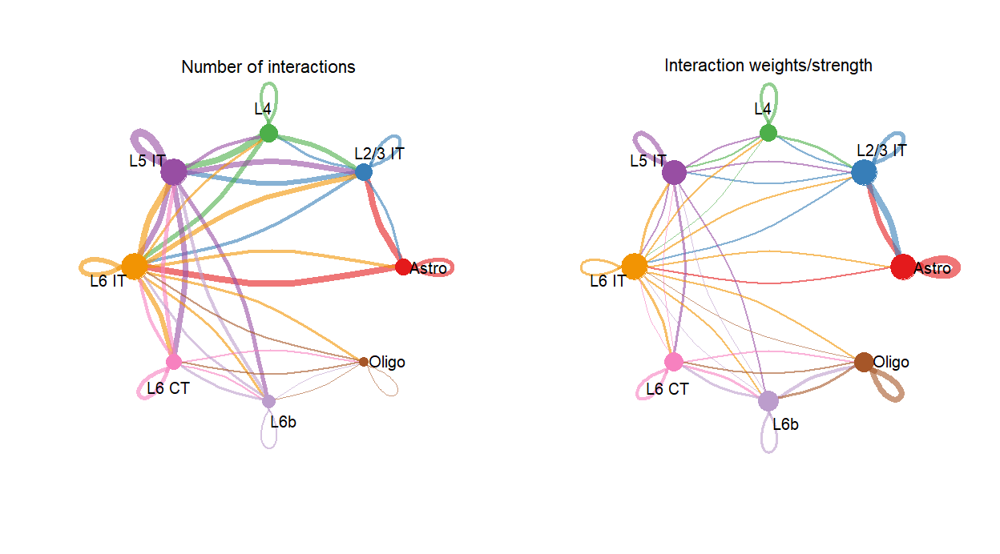
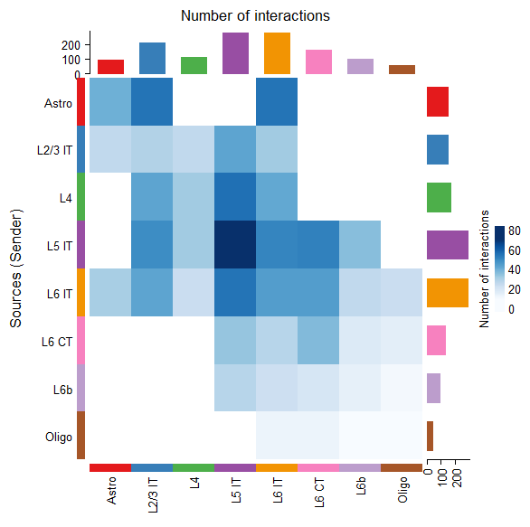
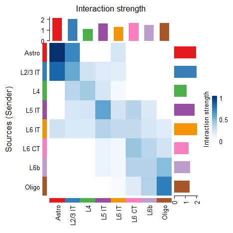
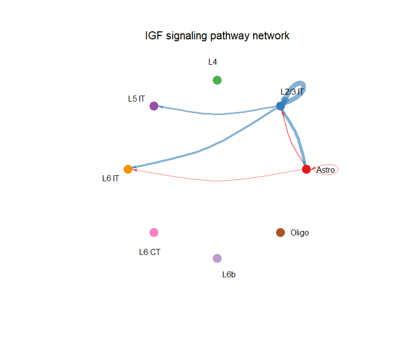
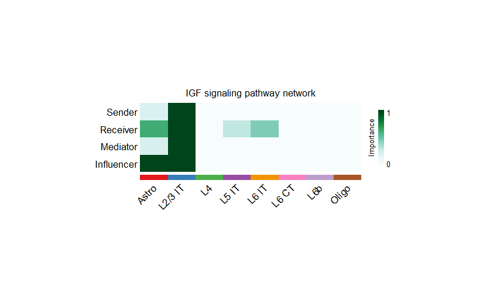
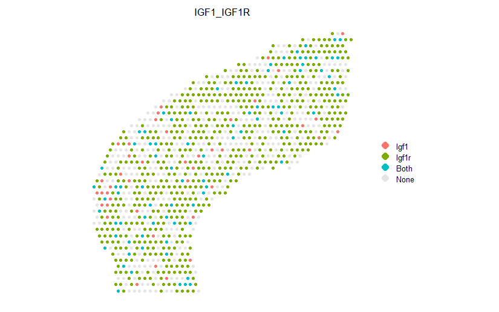

<!-- title: Cell cell communications in spatial transcriptomics  -->
# CellChat - Analysis of a Single Spatially Resolved Transcriptomics Tutorial

CellChat is an R package designed for inference, analysis, and visualization of cell-cell communication from single-cell and spatially resolved transcriptomics. CellChat aims to enable users to identify and interpret cell-cell communication within an easily interpretable framework, with the emphasis of clear, attractive, and interpretable visualizations. 


More information can be found at https://github.com/jinworks/CellChat


# System Requirement
Tested on Windows 11 12th Gen Intel(R) i7-1265U with R version 4.2.1.

# Installation

CellChat R package can be easily installed from Github using devtools:  

```
devtools::install_github("jinworks/CellChat")
```
**Please make sure you have installed the correct version of `NMF` and `circlize` package**. See instruction below. 

### Installation of other dependencies
If you run into issues when when installing dependencies (NMF, circlize, ComplexHeatmap, and UMAP-learn), please follow the troubleshooting instructions found [here](https://github.com/jinworks/CellChat?tab=readme-ov-file#installation-of-other-dependencies).

Some users might have issues when installing CellChat pacakge due to different operating systems and new R version. Please check the following solutions:

- **Installation on Mac OX with R > 3.6**: Please re-install [Xquartz](https://community.rstudio.com/t/imager-package-does-not-work-in-r-3-6-1/38119).
- **Installation on Windows, Linux and Centos**: Please check the solution for [Windows](https://github.com/jinworks/CellChat/issues/5) and [Linux](https://github.com/jinworks/CellChat/issues/131).  


# Part I: Data Input & Processing and Initialization of CellChat Object
## Prepare required input data for CellChat analysis
First, Prepare required input data for CellChat analysis. Input data can be downloaded from the following link [here](https://figshare.com/articles/dataset/10X_visium_data_for_spatial-informed_cell-cell_communication/23621151). 


First, load in the nessecary R libraries.
```
ptm = Sys.time()

library(CellChat)
library(patchwork)
options(stringsAsFactors = FALSE)
```

CellChat requires four user inputs in this case:
1. Gene expression data of spots/cells
2. User assigned cell labels and samples labels
3. Spatial coordinates of spots/cells
4. Spatial factors of spatial distance

Here we load a Seurat object of 10X Visium mouse cortex data and its associated cell meta data
```
load("data/visium_mouse_cortex_annotated.RData")

# show the image and annotated spots
color.use <- scPalette(nlevels(visium.brain)); names(color.use) <- levels(visium.brain)

Seurat::SpatialDimPlot(visium.brain, label = T, label.size = 3, cols = color.use)
```


Next, prepare input data for CellChat analysis
A column named `samples` should be provided for spatial transcriptomics analysis, which is useful for analyzing cell-cell communication by aggregating multiple samples/replicates. Of note, for comparison analysis across different conditions, users still need to create a CellChat object seperately for each condition.  

```
# Use normalized data matrix
data.input = Seurat::GetAssayData(visium.brain, slot = "data", assay = "SCT") 
```

A column named `samples` should be provided for spatial transcriptomics analysis, which is useful for analyzing cell-cell communication by aggregating multiple samples/replicates. Of note, for comparison analysis across different conditions, users still need to create a CellChat object seperately for each condition.  
```
# Define the meta data: 
# manually create a dataframe consisting of the cell labels
meta = data.frame(labels = Seurat::Idents(visium.brain), samples = "sample1", row.names = names(Seurat::Idents(visium.brain))) 

meta$samples <- factor(meta$samples)
unique(meta$labels) # check the cell labels
> [1] L2/3 IT Astro   L6b     L5 IT   L6 IT   L6 CT   L4      Oligo  
> Levels: Astro L2/3 IT L4 L5 IT L6 IT L6 CT L6b Oligo
unique(meta$samples) # check the sample labels
> [1] sample1
> Levels: sample1
```

Spatial locations of spots from full (NOT high/low) resolution images are required. For 10X Visium files, this information is in `tissue_positions.csv`. 
```
# load spatial transcriptomics information
spatial.locs = Seurat::GetTissueCoordinates(visium.brain, scale = NULL, cols = c("imagerow", "imagecol")) 
```

For 10X Visium, the conversion factor of converting spatial coordinates from Pixels to Micrometers can be computed as the ratio of the theoretical spot size (i.e., 65um) over the number of pixels that span the diameter of a theoretical spot size in the full-resolution image (i.e., 'spot_diameter_fullres' in pixels in the 'scalefactors_json.json' file). Of note, the 'spot_diameter_fullres' factor is different from the `spot` in Seurat object and thus users still need to get the value from the original json file. 

```
# Spatial factors of spatial coordinates
scalefactors = jsonlite::fromJSON(txt =  'scalefactors_json.json')
spot.size = 65 # the theoretical spot size (um) in 10X Visium
conversion.factor = spot.size/scalefactors$spot_diameter_fullres
spatial.factors = data.frame(ratio = conversion.factor, tol = spot.size/2)

d.spatial <- computeCellDistance(coordinates = spatial.locs, ratio = spatial.factors$ratio, tol = spatial.factors$tol)
min(d.spatial[d.spatial!=0]) # this value should approximately equal 100um for 10X Visium data
> [1] 99.52835
```

## Create a CellChat Object
There are different ways to initialize the spatial CellChat object (data matrix or Seurat object), but in this case, we will be starting from the seurat object. Here, the meta data in the object will be used by default and USER must provide group.by to define the cell groups. e.g, `group.by` = “ident” for the default cell identities in Seurat object.
```
cellchat <- createCellChat(object = data.input, meta = meta, group.by = "labels", datatype = "spatial", coordinates = spatial.locs, spatial.factors = spatial.factors)

cellchat
> An object of class CellChat created from a single dataset 
>   648 genes.
>   1073 cells. 
> CellChat analysis of spatial data! The input spatial locations are 
>                    x_cent y_cent
> AAACAGAGCGACTCCT-1   3164   7950
> AAACCGGGTAGGTACC-1   6517   3407
> AAACCGTTCGTCCAGG-1   7715   4371
> AAACTCGTGATATAAG-1   4242   9258
> AAAGGGATGTAGCAAG-1   4362   5747
> AAATAACCATACGGGA-1   3164   7537
```

## Set the Ligand-Receptor Interaction Database
Before we can employ CellChat to infer cell-cell communication, the ligand-receptor interaction database needs to be set to identify over-expressed ligands or receptors.
```
# When analyzing mouse samples, we use the database 'CellChatDB.mouse'
CellChatDB <- CellChatDB.mouse
showDatabaseCategory(CellChatDB)

# use a subset of CellChatDB for cell-cell communication analysis
CellChatDB.use <- subsetDB(CellChatDB, search = "Secreted Signaling", key = "annotation") # use Secreted Signaling

# set the used database in the object
cellchat@DB <- CellChatDB.use
```


## Preprocessing the Expression Data for Cell-Cell Communication Analysis
To infer the cell state-specific communications, CellChat identifies over-expressed ligands or receptors in one cell group and then identifies over-expressed ligand-receptor interactions if either ligand or receptor are over-expressed.
```
# subset the expression data of signaling genes for saving computation cost
cellchat <- subsetData(cellchat) # This step is necessary even if using the whole database
future::plan("multisession", workers = 4) 
cellchat <- identifyOverExpressedGenes(cellchat)
cellchat <- identifyOverExpressedInteractions(cellchat, variable.both = F)
> The number of highly variable ligand-receptor pairs used for signaling inference is 648
 
# project gene expression data onto PPI (Optional: when running it, USER should set `raw.use = FALSE` in the function `computeCommunProb()` in order to use the projected data)
# cellchat <- projectData(cellchat, PPI.mouse)
execution.time = Sys.time() - ptm
print(as.numeric(execution.time, units = "secs"))
> [1] 2565.9
```

# Part II: Inference of Cell-Cell Communication Network
CellChat infers the biologically significant cell-cell communication by assigning each interaction with a probability value and peforming a permutation test. CellChat models the probability of cell-cell communication by integrating gene expression with prior known knowledge of the interactions between signaling ligands, receptors and their cofactors using the law of mass action.

## Compute the Communication Crobability and Infer Cellular Communication Network
```
ptm = Sys.time()

cellchat <- computeCommunProb(cellchat, type = "truncatedMean", trim = 0.1, distance.use = TRUE, interaction.range = 250, scale.distance = 0.01,
                              contact.dependent = TRUE, contact.range = 100)

cellchat <- filterCommunication(cellchat, min.cells = 10)
```
## Infer the Cell-Cell Communication at a Signaling Pathway Level
CellChat computes the communication probability on signaling pathway level by summarizing the communication probabilities of all ligands-receptors interactions associated with each signaling pathway.
```
cellchat <- computeCommunProbPathway(cellchat)
```

## Calculate the Aggregated Cell-Cell Communication Network
We can calculate the aggregated cell-cell communication network by counting the number of links or summarizing the communication probability. USER can also calculate the aggregated network among a subset of cell groups by setting sources.use and targets.use.
```
cellchat <- aggregateNet(cellchat)

execution.time = Sys.time() - ptm
print(as.numeric(execution.time, units = "secs"))
> [1] 879.9437
```
CellChat can also visualize the aggregated cell-cell communication network. For example, showing the number of interactions or the total interaction strength (weights) between any two cell groups using circle plot. 
```
ptm = Sys.time()

groupSize <- as.numeric(table(cellchat@idents))
par(mfrow = c(1,2), xpd=TRUE)
netVisual_circle(cellchat@net$count, vertex.weight = rowSums(cellchat@net$count), weight.scale = T, label.edge= F, title.name = "Number of interactions")
netVisual_circle(cellchat@net$weight, vertex.weight = rowSums(cellchat@net$weight), weight.scale = T, label.edge= F, title.name = "Interaction weights/strength")
```


```
netVisual_heatmap(cellchat, measure = "count", color.heatmap = "Blues")
#> Do heatmap based on a single object
```


```
netVisual_heatmap(cellchat, measure = "weight", color.heatmap = "Blues")
#> Do heatmap based on a single object
```


# Part III: Visualization of Cell-Cell Communication Network
Upon infering the cell-cell communication network, CellChat provides various functionality for further data exploration, analysis, and visualization. Here we only showcase the `circle plot` and the new `spatial plot`.

## Visualization of Cell-Cell Communication at Different Levels: 
```
pathways.show <- c("IGF") 

# Circle plot
par(mfrow=c(1,1), xpd = TRUE) # `xpd = TRUE` should be added to show the title
netVisual_aggregate(cellchat, signaling = pathways.show, layout = "circle")
```


```
# Spatial plot
par(mfrow=c(1,1))
netVisual_aggregate(cellchat, signaling = pathways.show, layout = "spatial", edge.width.max = 2, vertex.size.max = 1, alpha.image = 0.2, vertex.label.cex = 3.5)
```


### Compute and Visualize the Network Centrality Scores:
```
# Compute the network centrality scores
cellchat <- netAnalysis_computeCentrality(cellchat, slot.name = "netP") # the slot 'netP' means the inferred intercellular communication network of signaling pathways

# Visualize the computed centrality scores using heatmap, allowing ready identification of major signaling roles of cell groups
par(mfrow=c(1,1))
netAnalysis_signalingRole_network(cellchat, signaling = pathways.show, width = 8, height = 2.5, font.size = 10)
```


We can show this information on the spatial transcriptomics when visualizing a signaling network, e.g., bigger circle indicates larger incoming signaling
```
par(mfrow=c(1,1))
netVisual_aggregate(cellchat, signaling = pathways.show, layout = "spatial", edge.width.max = 2, alpha.image = 0.2, vertex.weight = "incoming", vertex.size.max = 4, vertex.label.cex = 3.5)
```


Visualize gene expression distribution on tissue
```
# Take an input of a ligand-receptor pair
spatialFeaturePlot(cellchat, pairLR.use = "IGF1_IGF1R", point.size = 0.5, do.binary = FALSE, cutoff = 0.05, enriched.only = F, color.heatmap = "Reds", direction = 1)
> Applying a cutoff of  0.05 to the values...
```


Take an input of a ligand-receptor pair and show expression in binary
```
spatialFeaturePlot(cellchat, pairLR.use = "IGF1_IGF1R", point.size = 1, do.binary = TRUE, cutoff = 0.05, enriched.only = F, color.heatmap = "Reds", direction = 1)
```


# Cite
1. Suoqin Jin et al., CellChat for systematic analysis of cell-cell communication from single-cell and spatially resolved transcriptomics, bioRxiv 2023 [CellChat v2]
2. Suoqin Jin et al., Inference and analysis of cell-cell communication using CellChat, Nature Communications 2021 [CellChat v1] Citation:1717


# References:
1. https://github.com/jinworks/CellChat
2. https://figshare.com/articles/dataset/scRNA-seq_data_of_human_skin_from_patients_with_atopic_dermatitis/24470719
3. https://htmlpreview.github.io/?https://github.com/jinworks/CellChat/blob/master/tutorial/CellChat-vignette.html
4. https://htmlpreview.github.io/?https://github.com/jinworks/CellChat/blob/master/tutorial/CellChat_analysis_of_spatial_transcriptomics_data.html

