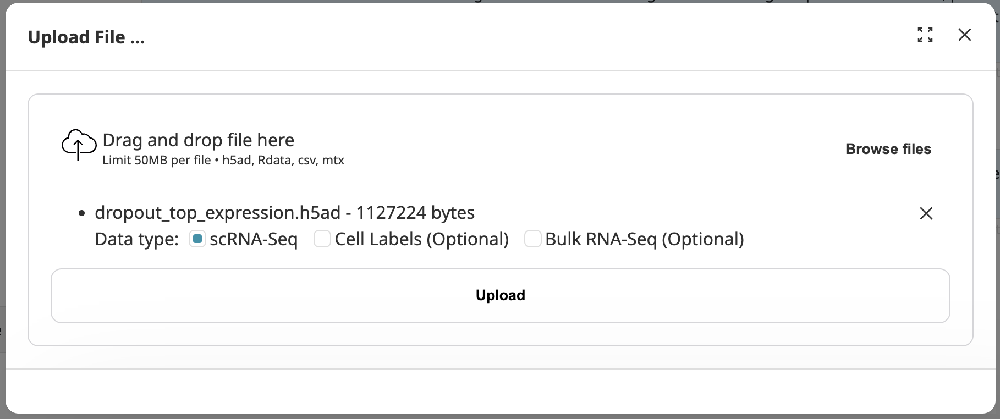

# scGNN3.0
## Overview
- **Workflow**: scGNN3.0 is an advanced web server designed to facilitate the analysis and visualization of single-cell genomics data using the scGNN model. Built on the powerful framework of ChatGPT-4.0, scGNN3.0 offers a unique interactive prompting interface that enhances user experience and efficiency in data processing and exploration.Users start sessions by inputting commands or queries, and each session is uniquely identified with a job ID for tracking and reference.
- **Upload input file**: Users must upload their primary dataset, which typically includes an scRNA-seq expression matrix. Optional files include bulk expression data and ground truth cell type labels.
Once data is uploaded, users can customize various model parameters through interactive prompts.
- **Get results**: Based on the user’s data and specified parameters, scGNN3.0 generates executable commands.These commands initiate the scGNN model processing in the background, associated with a unique task ID for each job.
- **Visualization**: After model execution, users can query the system using the task ID to review the analysis results.
## Upload files
There are three type of file you can upload to the scGNN-GPT server:
1.scRNA-Seq expression file -- the web server accepts '*.csv', '*.h5ad', '*.mtx', and '*.Rdata' format. If you want to run scGNN, you must upload scRNA-seq data as input.

2.(optinal)cell labels -- the web server accepts '*.csv' format
This is the ground truth cell labels for comparing the labels that scGNN gets in Sankey diagram. In other words, cell label file is optional to upload. But if you want to get Sankey diagram, you need to upload it.

3.(optinal)bulk RNA-Seq -- the web server accepts '*.csv', '*.h5ad', '*.mtx', and '*.Rdata' format.
It is also an optional file. If you want to get the results with integrating bulk RNA-seq data, you can upload this file. Also, for getting sankey diagram, you also need one cell label result with integrating bulk data and other label result is without integrating bulk.


## Customize parameters

If you want to set some customized parameters, please reference parameters below and set some parameters specific values in the prompt

| Parameter Name               | Description                                                                                                             |
| ---------------------------- | ----------------------------------------------------------------------------------------------------------------------- |
| **Program related**     | |
| `given_cell_type_labels`     | **Type**: boolean, **default**: False <br>If True, expect a cell type label file and will compute ARI against those labels.             |
| `dropout_prob`               | **Type**: float, **default**: 0.1 <br>This is the dropout rate of scRNA-seq expresssion matrix.               |
| `total_epoch`                | **Type**: int, **default**: 31 <br>Total EM epochs.                                                                                      |
| `ari_threshold`              | **Type**: float, **default**: 0.95 <br>The threshold for ARI.                                                                            |
| `graph_change_threshold`     | **Type**: float, **default**: 0.01 <br>The threshold for graph change.                                                                    |
| `alpha`                      | **Type**: float, **default**: 0.5 <br>&nbsp;                                                                                                   |
| **Data Loading related**          |   |
| `load_cell_type_labels`      | **Type**: path, **default**: None <br>If not None, will load cell type labels for the cells.                       |
| `load_LTMG`                  | **Type**: boolean, **default**: None <br>If specified, will use left-truncated mixture Gaussian (LTMG) to process dataset.                                          |
|`load_sc_dataset`| **Type**:str, default=''<br> If not None, will load the single-cell raw expression dataset'
|`--load_bulk_dataset`| **Type**:str, **default**: ''<br> If not None, will load bulk gene expression dataset'
| **scRNA-seq Input related Related**          |                                                                    |
| `load_from_csv`              | **Type**: str, **default**: None <br>If specified, will load the csv data as scRNA-seq expression matrix from this file path.                                             |
| `load_seurat_object`         | **Type**: str, **default**: None <br>If specified, will load the csv generated from the SeuratObject at this file path.         |
| `load_rdata`                 | **Type**: str, **default**: None <br>Path to R data file.                                                                                 |
| `load_from_10X`              | **Type**: str, **default**: None <br>If specified, will load the 10X data from this file path.                                             |
| `load_from_h5ad`             | **Type**: str, **default**: None <br>If specified, will load h5ad file from this file path
| **Feature Autoencoder Related**          |                                                                    |
| `feature_AE_epoch`              | **Type**: two integers separated by a space, **default**: 500 200 <br>First number being non-EM epochs, second number being EM epochs.    |
| `feature_AE_batch_size`         | **Type**: int, **default**: 12800 <br>Batch size.                                                                                        |
| `feature_AE_learning_rate`      | **Type**: float, **default**: 1e-3 <br>Learning rate.                                                                                    |
| `feature_AE_regu_strength`      | **Type**: float, **default**: 0.9 <br>In loss function, this is the weight on the LTMG regularization matrix.                           |
| `feature_AE_dropout_prob`       | **Type**: float, **default**: 0 <br>The dropout probability for feature autoencoder.                                                     |
| `feature_AE_concat_prev_embed`  | **Type**: str, **default**: None <br>Choose from {'feature', 'graph'}.                                                                   |
| **Graph Autoencoder related**     | |
| `graph_AE_epoch`                | **Type**: int, **default**: 200 <br>The epoch or graph autoencoder.                                                                      |
| `graph_AE_use_GAT`              | **Type**: boolean, **default**: False <br>If true, will use GAT for GAE layers; otherwise will use GCN layers.                           |
| `graph_AE_GAT_dropout`          | **Type**: int, **default**: 0 <br>The dropout probability for GAT.                                                                       |
| `graph_AE_learning_rate`        | **Type**: float, **default**: 1e-2 <br>Learning rate.                                                                                    |
| `graph_AE_embedding_size`       | **Type**: int, **default**: 16 <br>Graph AE embedding size.                                                                             |
| `graph_AE_concat_prev_embed`    | **Type**: boolean, **default**: False <br>If true, will concat GAE embed at t-1 with the inputed Feature AE embed at t for graph construction; else will construct graph using Feature AE embed only.|
| `graph_AE_normalize_embed`      | **Type**: str, **default**: None <br>Choose from {None, 'sum1', 'binary'}.                                                               |
| `graph_AE_graph_construction`   | **Type**: str, **default**: v2 <br>Choose from {'v0', 'v1', 'v2'}.                                                                      |
| `graph_AE_neighborhood_factor`  | **Type**: int, **default**: 10 <br>&nbsp;                                                                                                     |
| `graph_AE_retain_weights`       | **Type**: boolean, **default**: False <br>&nbsp;                                                                                               |
| `gat_multi_heads`               | **Type**: int, **default**: 2 <br>&nbsp;                                                                                                       |
| `gat_hid_embed`                 | **Type**: int, **default**: 64 <br>The dimension for hid_embed.                                                                                |
| **Clustering Related**          | **Parameters related to clustering processes**                                                                          |
| `clustering_louvain_only`       | **Type**: boolean, **default**: False <br>If true, will use Louvain clustering only; otherwise, first use Louvain to determine clusters count (k), then perform KMeans.|
| `clustering_use_flexible_k`     | **Type**: boolean, **default**: False <br>If true, will determine k using Louvain every epoch; otherwise, will rely on the k in the first epoch.|
| `clustering_embed`              | **Type**: str, **default**: 'graph' <br>Choose from {'feature', 'graph', 'both'}.                                                        |
| `clustering_method`             | **Type**: str, **default**: 'KMeans' <br>Choose from {'KMeans', 'AffinityPropagation'}.                                                   |
| `cluster_AE_epoch`              | **Type**: int, **default**: 200 <br>The epoch for cluster AE.                                                                            |
| `cluster_AE_batch_size`         | **Type**: int, **default**: 12800 <br>Batch size.                                                                                        |
| `cluster_AE_learning_rate`      | **Type**: float, **default**: 1e-3 <br>Learning rate.                                                                                    |
| `cluster_AE_regu_strength`      | **Type**: float, **default**: 0.9 <br>In loss function, this is the weight on the LTMG regularization matrix.                           |
| `cluster_AE_dropout_prob`       | **Type**: float, **default**: 0 <br>The dropout probability for cluster AE.                                                              |
| **Deconvolution related**     | |
| `deconv_opt1_learning_rate`     | **Type**: float, **default**: 1e-3 <br>Learning rate.                                                                                     |
| `deconv_opt1_epoch`             | **Type**: int, **default**: 5000 <br>Epoch.                                                                                              |
| `deconv_opt1_epsilon`           | **Type**: float, **default**: 1e-4 <br>Epsilon.                                                                                          |
| `deconv_opt1_regu_strength`     | **Type**: float, **default**: 1e-2 <br>Strength.                                                                                         |
| `deconv_opt2_learning_rate`     | **Type**: float, **default**: 1e-1 <br>&nbsp;                                                                                                   |
## The output you will get
After running scGNN model, you will get the results under the '--output_dir' directory--
| File Name               | Description                                                                                                             |
| ---------------------------- | ----------------------------------------------------------------------------------------------------------------------- |
all_metrics.csv | The performance of each epoch
clustering_embedding.csv | The embedding results for cell clustering
feature_embedding.csv | The feature embedding for each cell
graph_edgeList.csv | The cell graph edge information based on feature embedding. This file is used to plot the cell graph
graph_embedding.csv | The graph embedding for each cell
imputed.csv (if you use Rdata format, this file should be 'imputed.Rdata') | imputed gene expression
labels.csv | cell label result from scGNN

## Visualize Results
We provide 3 plots to visualzie scGNN results you just get.
### Heat Map
The heat map visualization would get the heat map of original scRNA-seq gene expression, imputed gene expression (from scGNN), and the difference.
```
heatmap(original_filepath,imputed_filepath,label_filepath,save_filepath)
```

#### Parameters
- 'original_filepath': the file path of input data set the gene expression file. 

- 'imputed_filepath': the file path of the imputed result.

- 'label_filepath': the file path of the labels.

- 'save_filepath': the file path where to save the heapmap result.

### Cell-Cell Graph
The Cell-Cell graph is to visualize the graph edgeList got from feature embedding.
```
cellcell_graph(edgelist_path, label_path, embed_path,save_path)
```

#### Parameters
- 'true_label_path': it is the ground truth cell type labels.

- 'edgelist': the 'graph_edgeList.csv'.

- 'label_path': the directory path of scGNN generated cell labels.

- 'embed_path': the directory path of 'graph_embedding.csv' file.

- 'save_path': this should be the path where to save the plotting result. 

### Sankey Diagram
The Sankey diagram is the cell label annotation accuarcy comparsion between only scRNA-seq input and scRNA-seq input with integrating bulk sequence data.

```
sankey(file_list,save_filepath)
```
#### Parameters
- The file_list consists of labels file generated without bulk, ground truth labels file, and labels file with bulk data.

- save_filepath is the where to save the sankey result, like './plot_result/sankey.png'

## scGNN3.0-server usage example
- Upload files for scGNN running
  - Click this button:
    
  - upload your data and select data type:
    
- When your data is ready, the chatrobot will guide you to provide some order. 
  - Then you can run scGNN by using this uploaded data:
    
  - When the task results are ready, the UMAP figure will be provided automatically.
    
- Now, you can download the result data of scGNN output:
  - Click the download button:
    
  - The generated code and task result files are provided to download:
    
- Then, results are ready, you probably want to see some analysis figure:
  - Ask the chat robot to draw a HeatMap figure by using the output of scGNN:
    
    When figures are ready, they will be provided automatically
    
  - You can also define customized colors:
    
    When figures are ready, they will be provided automatically
    
  - Same thing, Cell-Cell Graph figure is like:
    
- All results including plotting figures are provided to download.


